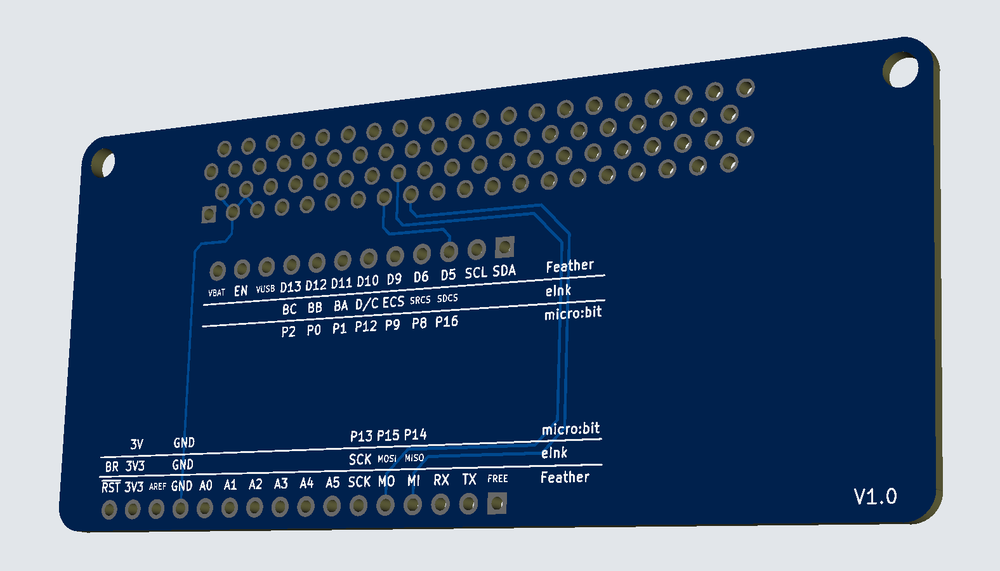

# micro:bit eInk Feather Adaptor

This is a simple FeatherWing to micro:bit adaptor board designed specifically
for the Adafruit 2.9" Grayscale eInk / ePaper Display FeatherWing:
https://www.adafruit.com/product/4777

## Repository Contents

- **datasheets**: Datasheets for the components used in this adaptor board
- **docs**: Documentation related to this adaptor board
- **firmware**: Arduino Skectch to test the eInk FeatherWing with a micro:bit
- **hardware**: The KiCad project files
- **output**: Project output files, like schematic PDFs.
    - **interactive_bom**: BOM output from the
      [Interactive HTML BOM](https://github.com/openscopeproject/InteractiveHtmlBom)
      KiCad plugin.
    - **pdf**: Schematic PDFs.
    - **production**: Gerber and drill files.

## Documentation

- Pinout connections for the adaptor board: [docs/pins.md](docs/pins.md)
- [eInk FeatherWing product page](https://www.adafruit.com/product/4777)
- [Adafruit documentation for the eInk FeatherWing](https://learn.adafruit.com/adafruit-eink-display-breakouts/grayscale-29-overview)
- [Documentation for the family of Adafruit 2.9" eInk Display Breakouts and FeatherWings](https://learn.adafruit.com/adafruit-2-9-eink-display-breakouts-and-featherwings/)
- Project Changelog: [CHANGELOG.md](CHANGELOG.md)

## License & Attributions

The Arduino test sketch is based on the
[Adafruit EDP ThinkInk_gray4 example][6], with [MIT License][7].

The micro:bit edge connector is [MIT Licensed][8] and comes from:
https://github.com/anthonykirby/kicad_microbit_connector

This project has been based on this FeatherWing template:
https://github.com/ppelleti/FeatherWing-template-KiCad

The FeatherWing template and the rest of the repository (except where stated
otherwise) is licensed under [the same terms as the KiCad libraries][9],
which is the [CC-BY-SA 4.0][10] license, with an exception that says that
electronic designs based on this repository are not bound by the attribution
and share-alike conditions.

[6]: https://github.com/adafruit/Adafruit_EPD/blob/4.4.3/examples/ThinkInk_gray4/ThinkInk_gray4.ino
[7]: firmware/eink_feather_test/LICENSE
[8]: hardware/microbit_connector/LICENSE
[9]: https://forum.kicad.info/t/kicad-library-licensing/7856
[10]: https://creativecommons.org/licenses/by-sa/4.0/legalcode
