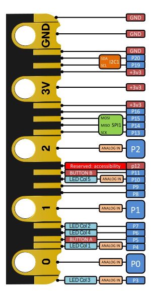

# Pins

## Board Pin Routing

This table show the feather to micro:bit pins connections.

None of the micro:bit pins selected have other functionality (like the
matrix display or buttons). The P0, P1, and P2 micro:bit pins have weak pull
ups and so, they have been assigned to the eInk feather buttons, as that should
not affect their operation.

| Feather ⬅️ | eInk | micro:bit pin | | Feather ➡️ | eInk | micro:bit pin |
|------------|------|---------------|-|-----------|------|---------------|
| RST    | RST      | -             | |       |          |               |
| 3.3V   | 3V       | -             | |       |          |               |
| Aref   | -        | -             | |       |          |               |
| GND    | GND      | -             | |       |          |               |
| A0     | -        | -             | | Bat   | -        | -             |
| A1     | -        | -             | | En    | -        | -             |
| A2     | -        | -             | | VUSB  | -        | -             |
| A3     | -        | -             | | D13   | C Button | P2            |
| A4     | -        | -             | | D12   | B Button | P0            |
| A5     | -        | -             | | D11   | A Button | P1            |
| SCK    | SCK      | P13 (SCK)     | | D10   | D/C      | P12           |
| MO     | MOSI     | P15 (MOSI)    | | D9    | ECS      | P9            |
| MI     | MISO     | P14 (MISO)    | | D6    | SRCS     | P8            |
| RX     | -        | -             | | D5    | SDCS     | P16           |
| TX     | -        | -             | | SCL   | -        | -             |
| Free   | -        | -             | | SDA   | -        | -             |

Feather pins:
- RST - Connected to the Reset button in the eInk feather
- SCK - SPI Clock
- MO - SPI MOSI from microcontroller to feather
- MI - SPI MISO from feather to microcontroller
- Button A/B/C - Connected to the three top button in the feather
- D/C - The eInk Data/Command pin, required for controlling the display
- ECS - Eink SPI Chip Select
- SRCS - SRAM SPI Chip Select
- SDCS - SD Card SPI Chip Select

eInk feather pinout from:
https://learn.adafruit.com/adafruit-eink-display-breakouts/pinouts-2

## Pinouts

This section contains the micro:bit V2 and Generic Feather pinouts for
reference.

### micro:bit V2 pinout

From: https://tech.microbit.org/hardware/edgeconnector/#edge-connector-pins

### Feather pinout

This is the generic feather pinout, which might change slightly depending on
the board. From:
https://learn.adafruit.com/adafruit-feather/feather-specification#pin-naming-3096825-19

| Feather left header | Feather right header |
|---------------------|----------------------|
| Rst  |      |
| 3.3V |      |
| Aref |      |
| GND  |      |
| A0   | Bat  |
| A1   | En   |
| A2   | VUSB |
| A3   | D13  |
| A4   | D12  |
| A5   | D11  |
| SCK  | D10  |
| MO   | D9   |
| MI   | D6   |
| RX   | D5   |
| TX   | SCL  |
| Free | SDA  |
